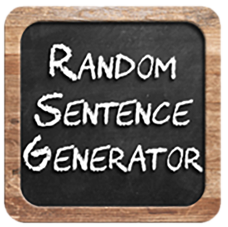

# "Random-Sentences-Generator"
</img>

A simple console-based Java program.
The program generates random sentences using a simple method for getting a random words.
The *Generator* is based on the following model:
<ul>
o	<ul>[Sentence] = [Who] +[Action] + [Detail].</ul>
	
o	<ul>**Who** = [Name + from + Place] example:("David from London").</ul>
	<li>Names = {"Peter", "Michell", "Jane", "Steve", ...}</li>
	<li>Places = {"Sofia", "Plovdiv", "Varna", "Burgas", ...}</li>
	
o	<ul>**Action** = [Adverb] + [Verb] + [Noun] example: ("calmly watched the sunset").</ul>
	
	<li>Verbs = {"eats", "holds", "sees", "plays with", "brings", ...}</li>
	<li>Nouns = {"stones", "cake", "apple", "laptop", "bikes", ...}</li>
	<li>Adverbs = {"slowly", "diligently", "warmly", "sadly", "rapidly", ...}</li>
	
o	<ul>**Details** = {"near the river", "at home", "in the park", ...}</ul>
	
</ul>	
• Source code link: https://github.com/aChaushev/RandomSentencesGeneratorBy_aChaushev/blob/main/RandomSentences.java
• ***by aChaushev***